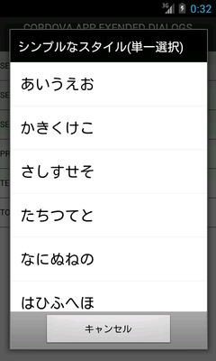
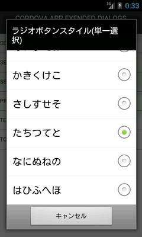
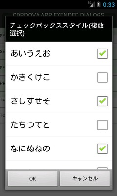
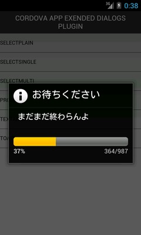
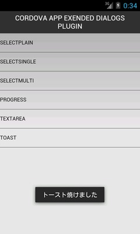
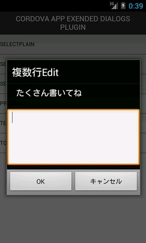

# Cordova-Plugin-ExDialogs

PhoneGap(Cordova)公式の[通知係プラグイン](https://github.com/apache/cordova-plugin-dialogs)でサポートされていない種類のネイティブダイアログなどを実装したプラグインです。

Android版のみの対応です。

## インストール

Node.jsのPhoneGap開発環境(phonegap or cordova)で作成されたプロジェクト上で

    $ phonegap local plugin add https://github.com/ktty1220/cordova-plugin-exdialogs

or

    $ cordova plugin add https://github.com/ktty1220/cordova-plugin-exdialogs

を実行してください。

## 使用方法

本プラグインをインストールすると、JavaScript上で`navigator.notification.ex`というオブジェクトが使用可能になります。このオブジェクトが提供するメソッドを利用して各種ダイアログなどを表示します。

## API

### selectPlain(win, fail, items, title, icon)

シンプルなスタイルの選択ダイアログを表示します。

#### 引数

* win (関数)

    ダイアログで表示している選択肢のどれかが選択された時に実行されるコールバック関数です。

    コールバック関数には0から始まる選択肢のインデックスが引数として渡されます(上から3番目の選択肢が選択された場合は`2`が入る)。

* fail (関数)

    ダイアログの表示が何らかの原因で失敗した時に実行されるコールバック関数です。呼び出し時のパラメータがおかしかったりする場合に発生します。

    コールバック関数にはエラーオブジェクトが渡されます。

* items (配列)

    選択肢の文字列を配列で指定します。

* title ※省略可能

    ダイアログのタイトルを指定します。

* icon (文字列) ※省略可能 

    ダイアログのタイトルの頭に表示されるアイコンです。Android標準のダイアログアイコンリソースIDを指定します。リソースID一覧は[こちら](http://androiddrawables.com/Dialog.html)を参照してください。

#### 例

    // 選択肢の配列
    var items = [
      'あいうえお',
      'かきくけこ',
      'さしすせそ',
      'たちつてと',
      'なにぬねの',
      'はひふへほ'
    ];

    // 正常終了時のコールバック関数
    var onSuccess = function (index) {
      console.log('選択されたのは' + items[index] + 'です');
    };

    // エラー時のコールバック関数
    var onError = function (err) {
      console.error(err);
    };

    // 選択ダイアログを表示
    navigator.notification.ex.selectPlain(onSuccess, onError, items, '選択してください', 'ic_dialog_info');

### selectSingle(win, fail, items, init, title, icon)

ラジオボタンスタイルの選択ダイアログを表示します。`selectPlain`との違いは初期選択状態をセットできる点です。

#### 引数

* win (関数)

    ダイアログで表示している選択肢のどれかが選択された時に実行されるコールバック関数です。

    コールバック関数には0から始まる選択肢のインデックスが引数として渡されます(上から3番目の選択肢が選択された場合は`2`が入る)。

* fail (関数)

    ダイアログの表示が何らかの原因で失敗した時に実行されるコールバック関数です。呼び出し時のパラメータがおかしかったりする場合に発生します。

    コールバック関数にはエラーオブジェクトが渡されます。

* items (配列)

    選択肢の文字列を配列で指定します。

* init (数値) ※省略可能 

    初期選択位置のインデックス(0始まり)を指定します(先頭の選択肢を初期選択状態にする場合は`0`を指定する)。

* title (文字列) ※省略可能 

    ダイアログのタイトルを指定します。

* icon (文字列) ※省略可能 

    ダイアログのタイトルの頭に表示されるアイコンです。Android標準のダイアログアイコンリソースIDを指定します。リソースID一覧は[こちら](http://androiddrawables.com/Dialog.html)を参照してください。

#### 例

    // 選択肢の配列
    var items = [
      'あいうえお',
      'かきくけこ',
      'さしすせそ',
      'たちつてと',
      'なにぬねの',
      'はひふへほ'
    ];

    // 正常終了時のコールバック関数
    var onSuccess = function (index) {
      console.log('選択されたのは' + items[index] + 'です');
    };

    // エラー時のコールバック関数
    var onError = function (err) {
      console.error(err);
    };

    // 選択ダイアログを表示(一番下の選択肢を選択状態 & アイコンなし)
    navigator.notification.ex.selectSingle(onSuccess, onError, items, items.length - 1, '選択してください');

### selectMulti(win, fail, items, init, title, icon)

チェックボックススタイルの選択ダイアログを表示します。`selectPlain`や`selectSingle`は単一選択用ですが、`selectMulti`は複数の選択肢を選んで返す事ができます。

#### 引数

* win (関数)

    ダイアログで表示している選択肢のどれかが選択された時に実行されるコールバック関数です。

    コールバック関数には`"0"`から始まるインデックス(文字列)と選択状態がペアになった連想配列です。

    例) 3, 4, 5番目の選択肢にチェックを入れた状態でOKボタンが押された場合

        {
          "0": false,
          "1": false,
          "2": true,
          "3": true,
          "4": true
        }

* fail (関数)

    ダイアログの表示が何らかの原因で失敗した時に実行されるコールバック関数です。呼び出し時のパラメータがおかしかったりする場合に発生します。

    コールバック関数にはエラーオブジェクトが渡されます。

* items (配列)

    選択肢の文字列を配列で指定します。

* init (配列 or null) ※省略可能 

    初期選択状態を指定します。`selectSingle`と異なり複数の選択状態を指定するので、選択肢の順番に`true`,`false`のいずれかを指定した配列をセットします。`null`を指定すると何も選択していない状態となります。

    例) 1, 3番目の選択肢がチェックされた状態でダイアログを表示する場合

        [ true, false, true, false, false ]

* title (文字列) ※省略可能 

    ダイアログのタイトルを指定します。

* icon (文字列) ※省略可能 

    ダイアログのタイトルの頭に表示されるアイコンです。Android標準のダイアログアイコンリソースIDを指定します。リソースID一覧は[こちら](http://androiddrawables.com/Dialog.html)を参照してください。

#### 例

    // 選択肢の配列
    var items = [
      'あいうえお',
      'かきくけこ',
      'さしすせそ',
      'たちつてと',
      'なにぬねの',
      'はひふへほ'
    ];

    // 正常終了時のコールバック関数
    var onSuccess = function (results) {
      for (index in results) {
        if (results[index]) {
          console.log(items[Number(index)] + 'は選択されています');
        }
      }
    };

    // エラー時のコールバック関数
    var onError = function (err) {
      console.error(err);
    };

    // 選択ダイアログを表示(1, 3, 4番目を選択状態)
    var init = [ true, false, true, true, false ];
    navigator.notification.ex.selectSingle(onSuccess, onError, items, init, '選択してください', 'ic_dialog_info');

    // 選択ダイアログを表示(初期選択なし & アイコンなし)
    navigator.notification.ex.selectSingle(onSuccess, onError, items, null, '選択してください');

### progressStart(win, fail, message, title, max)

プログレスバーダイアログを表示します。[公式プラグイン](https://github.com/apache/cordova-plugin-dialogs)ではドキュメントに書かれていませんがこっそり実装はされています(たぶんAndroidのみ)。

しかし実装のされ方が適当で、最大値が100固定だったり、処理が完了したのかキャンセルされたのかが判別できない作りになったいたりするので、その辺をサポートしたバージョンをこちらで実装しています。

#### 引数

* win (関数)

    ダイアログで表示している選択肢のどれかが選択された時に実行されるコールバック関数です。

    コールバック関数には`0`(正常終了)もしくは`1`(キャンセルされた)が渡されます。

* fail (関数)

    ダイアログの表示が何らかの原因で失敗した時に実行されるコールバック関数です。呼び出し時のパラメータがおかしかったりする場合に発生します。

    コールバック関数にはエラーオブジェクトが渡されます。

* message (文字列)

    プログレスバーの上に表示されるメッセージを指定します。後から変更可能です。

* title (文字列)

    ダイアログのタイトルを指定します。

* max (数値) ※省略可能 

    プログレスバーの最大値を指定します。デフォルトは`100`です。

### progressValue(value, message)

プログレスバーの状態を更新します。先に`progressStart()`を実行してプログレスバーが表示されている必要があります。

#### 引数

* value (数値)

    `progressStart()`で指定した`max`値に対する現在のプログレスバーの位置を指定します。

* message (文字列)

    `progressStart()`で指定した`message`を変更する場合に指定します。

> `message`を指定するとタイトルバーがなくなる事があるようです(未解決)。

### progressStop()

プログレスバーを閉じます。途中でキャンセルされていた場合は何もされません。

#### プログレスバーの一連の動作例

    var timer;

    // 正常終了時のコールバック関数
    var onSuccess = function (isCanceled) {
      if (isCanceled > 0) {
        // キャンセルされたのでプログレスバー更新タイマーを解除
        clearInterval(timer);
        return;
      }
      // 処理が完了した
    };

    // エラー時のコールバック関数
    var onError = function (err) {
      console.error(err);
    };

    // プログレスバーダイアログを表示(最大値321)
    var max = 321;
    navigator.notification.ex.progressStart(onSuccess, onError, '始まり', 'お待ちください', max);

    // 1秒毎にプログレスバー更新
    var count = 0;
    timer = setInterval(function() {
      count++;
      navigator.notification.ex.progressValue(count, '現在' + count + '番目の処理です');
      if (count >= max) {
        clearInterval(timer);
        navigator.notification.ex.progressStop();
      }
    }, 1000);

### toast(message)

トーストメッセージを表示します。

#### 引数

* message (文字列)

    表示するメッセージを指定します。

#### 例

        navigator.notification.ex.toast('データを保存しました');

### textArea(message, win, title, line)

複数行のテキスト入力ダイアログを表示します。

#### 引数

* message (文字列)

    テキスト入力エリアの上に表示されるメッセージを指定します。

* win (関数)

    テキストを入力してOKボタンが押された時に実行されるコールバック関数です。

    コールバック関数には入力されたテキストが渡されます。

* title (文字列) ※省略可能

    ダイアログのタイトルを指定します。

* line (数値) ※省略可能

    テキスト入力エリアの行数を指定します。デフォルトは`5`です。

#### 例

    var onEditFinish = function (text) {
      console.log(text);
    });

    navigator.notification.ex.textArea('3行で頼む', onEditFinish, 'メッセージを入力してください', 3);

## 対応バージョン

PhoneGap3.4.0での動作を確認しています。それ以下のバージョン(特にバージョン3より前)では正常に動作しない可能性があります。

## Changelog

### 0.1.0 (2014-04-23)

* 初版リリース

## ライセンス

[MIT license](http://www.opensource.org/licenses/mit-license)で配布します。

&copy; 2014 [ktty1220](mailto:ktty1220@gmail.com)
